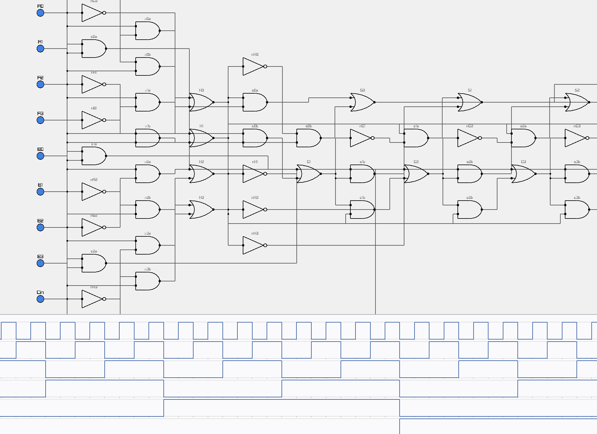

# dcs

 

**DCS (Digital Circuit Simulation)** lets you draw logic circuits on a screen and watch them run.

You drop gates onto a canvas — AND, OR, NOT, NAND, NOR, XOR, XNOR — wire their pins together, flip the inputs on or off, and see how the outputs change over time. Start with one gate; build up to an adder, a multiplier, eventually a whole CPU.

---

## Getting started

- **[INSTALL.md](./INSTALL.md)** — build DCS on Windows / MSYS2.
- **[QUICKSTART.md](./QUICKSTART.md)** — draw and simulate your first circuit in five minutes.

## More

- **[CHANGELOG.md](./CHANGELOG.md)** — what's in each release.
- **[history.md](./history.md)** — the full design trail, prototype through v1.0.0.
